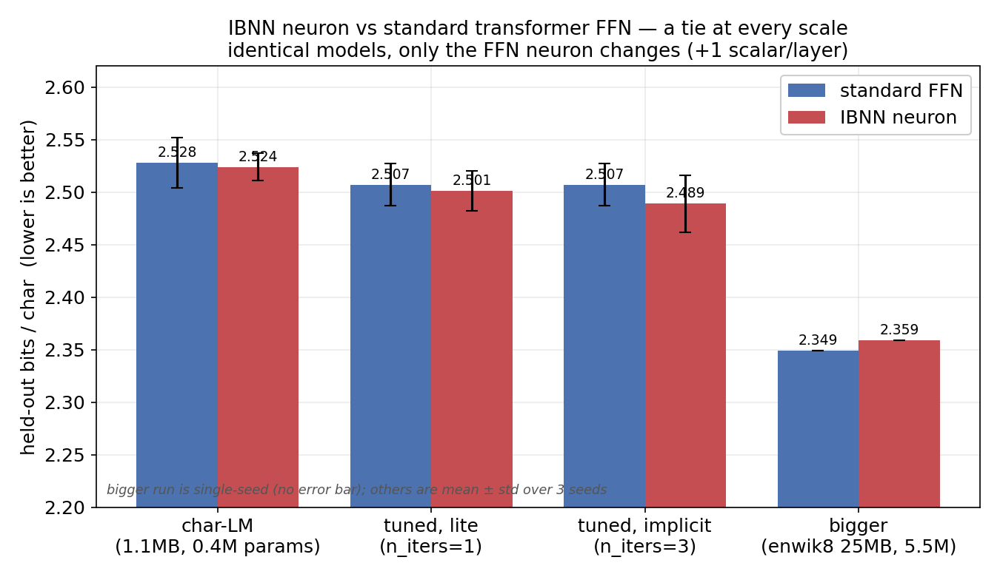
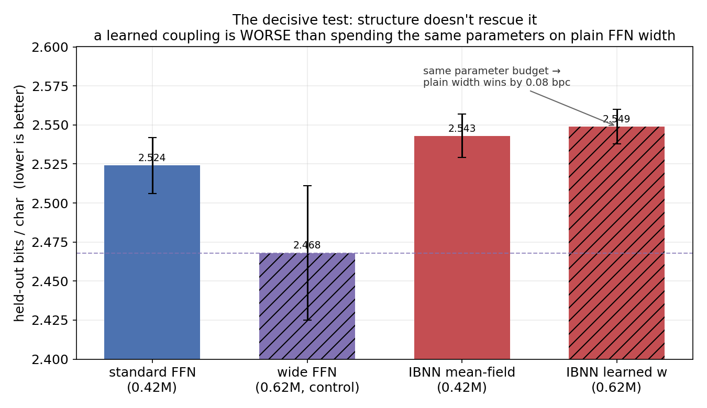
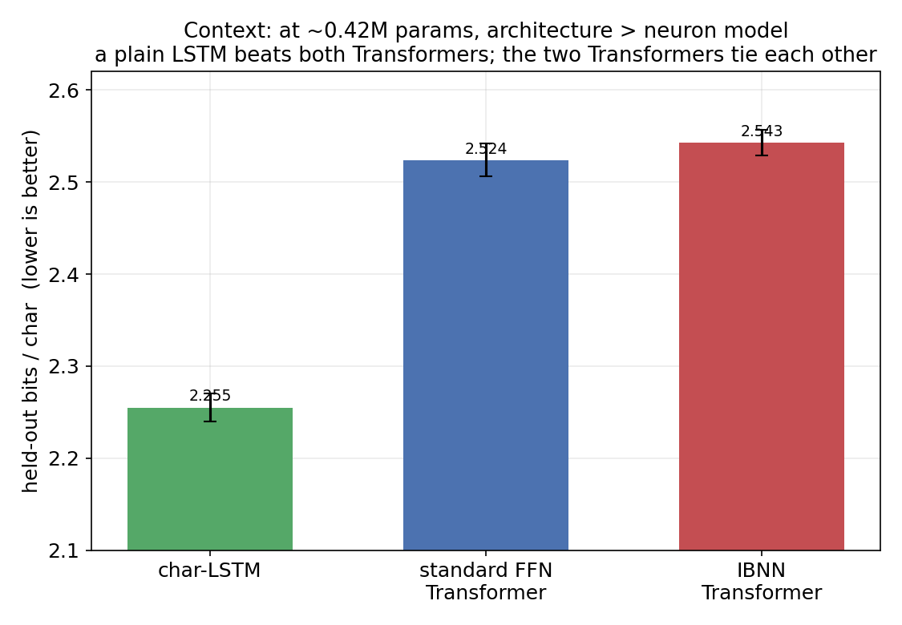

# ibnn-lm — does the "updated neuron" help a Transformer language model?

A transformer/language-model fork of the **Implicit Bias Neural Network (IBNN)** neuron from
Mohedano, Batard, Velasco-Salido, De Los Santos Mendoza, Martínez, Levine & Bertalmío,
*[Updating the standard neuron model in artificial neural networks](https://arxiv.org/abs/2605.30370)*
(arXiv:2605.30370, 2026); upstream CNN code at
[github.com/vmg-io-csic/ibnn](https://github.com/vmg-io-csic/ibnn).

The paper validates a new neuron model on **CNNs for image classification**, and explicitly
lists "a Transformer using the updated neuron model" as open future work. This repo is an
honest attempt at exactly that: re-implement the essential neuron math as a fully-connected
layer, drop it into the FFN of a nanoGPT-style decoder, and run a **controlled, reproducible,
local** comparison against a standard Transformer FFN at matched parameter count.

> **TL;DR (honest outcome).** With a verified-correct integration, the IBNN neuron is **not
> measurably better than a standard Transformer FFN** at character-LM scale — across full vs
> scarce data, per-model hyperparameter tuning, the cheap and the full implicit solve, and a
> 13× scale-up. A *learned* (non–mean-field) coupling is actually **worse** than spending the
> same parameters on plain FFN width. This is a **null result**, reported as such. The likely
> reason is structural (below), not a bug — and it says nothing about IBNN in its native
> CNN/image regime, where the paper's gains were demonstrated.



---

## 1. The neuron

Standard Transformer FFN hidden unit (the "Standard Model", SM):

```
u_i = φ( (W x)_i − b_i )
```

IBNN hidden unit (this fork):

```
z_i = (W x)_i − b_i  −  λ · Σ_k w_ik · tanh( p · (z_k − z_i) )
v_i = φ( z_i )
```

- The lateral coupling runs over the **hidden channels** of the FFN, applied **independently
  per token position** — automatically causal, no masking, parallel across the sequence.
  (Coupling across the *token* axis would re-invent attention and break causality.)
- `w_ik` is uniform (`1/D`), so the new term adds **no weight parameters**; `λ` is a single
  (optionally trainable) scalar per layer. An IBNN model has exactly **+n_layer** parameters
  vs its SM twin.
- `z` is implicit. We solve by a damped fixed-point iteration from the SM pre-activation.
  `num_iters=1` is the cheap **"lite"** layer (forward only); `num_iters>1` unrolls the solve
  and is differentiated by autograd.

## 2. Is it integrated correctly? (yes — verified, not assumed)

A null result is only meaningful if the implementation is faithful. Two checks, both in
`ibnn_lm/sanity.py` (all 9 checks pass):

- **Exact superset.** An IBNN GPT with `λ=0` produces **bit-identical logits** to its SM twin
  (`max|Δ| = 0.0`). So the only thing that differs in every comparison below is the lateral
  coupling itself.
- **Materially active.** The trained `λ` drifts from −0.05 to ≈ **−0.39**, changing output
  logits by ~47% and perturbing each hidden unit by ~19% of its activation scale. The
  mechanism is genuinely engaged — it just doesn't move held-out loss.

The lateral term also matches the paper's equation exactly (checked against a naive
reference), and the fixed-point residual shrinks with `num_iters`.

## 3. Methods

- **Task / metric.** Character-level language modelling; we report exact held-out
  **bits-per-character (BPC)** = mean next-token NLL / ln 2 (the standard char-LM metric),
  computed deterministically over the *entire* validation split (`ibnn_lm/evaluate.py`).
  Standard NLP leaderboards (GLUE, HellaSwag, …) don't apply at ~0.4–5.5M params / char level.
- **Controlled A/B.** Identical GPT (embeddings, attention, LayerNorm, residuals, LM head,
  optimizer, LR schedule, step budget, seeds) — only the FFN neuron changes. IBNN adds +1
  scalar/layer, so parameter count is essentially equal.
- **Statistics.** 3 seeds per cell (mean ± std) except the single-seed scale-up; differences
  smaller than the combined seed std are reported as ties.
- **Hardware.** Runs locally; Apple-Silicon **MPS** GPU auto-detected (else CUDA, else CPU).

## 4. Experiments & results

All numbers are exact held-out **BPC, lower is better**. Reproduce each with the `make` target
shown; raw per-run numbers are saved under `runs/*.json`.

### 4.1 Equal-size A/B, full and scarce data — `make compare` / `make data-efficiency`

| training data | standard FFN | IBNN FFN | Δ (IBNN−SM) | verdict |
|---|---|---|---|---|
| 100% (≈1M chars) | 2.528 ± 0.024 | 2.524 ± 0.013 | −0.004 | tie |
| 10% (data-efficiency) | 3.238 ± 0.022 | 3.239 ± 0.034 | +0.001 | tie |

The paper's headline claim is **data efficiency** (the updated neuron should help most when
data is scarce). It does not appear here.

### 4.2 Tuned, and with the full implicit solve — `make tune`

Per-model learning-rate search → 3-seed final (smaller `d_ff` so `num_iters=3` is affordable).
Tuning moved the best LR to 1e-2 for *every* model (worth ~0.02 bpc — so "tune per model" was a
fair ask) but did not change the ranking:

| model | tuned LR | BPC | Δ vs SM |
|---|---|---|---|
| standard FFN | 1e-2 | 2.507 ± 0.020 | — |
| IBNN, lite (`num_iters=1`) | 1e-2 | 2.501 ± 0.019 | −0.006 (tie) |
| IBNN, implicit (`num_iters=3`) | 1e-2 | 2.489 ± 0.027 | −0.018 (tie) |

A faint monotonic trend (n=3 < n=1 < SM in the mean), but inside seed noise — and `num_iters=3`
costs ~2.7× the training compute of `num_iters=1`.

### 4.3 Bigger model + bigger corpus — single seed

13× the parameters, 22× the data (5.5M params; enwik8, byte-level, 22.5M train tokens):

| model | params | BPC |
|---|---|---|
| standard FFN | 5.5M | **2.349** |
| IBNN FFN | 5.5M | 2.359 |

Δ = +0.010 (IBNN marginally behind, within the ~0.02 seed noise). `λ` trained even harder here
(to −0.39) yet IBNN still tied SM while costing ~26× the wall-clock. **The tie holds at scale.**

### 4.4 The decisive test: does breaking the mean-field symmetry help? — `make coupling-test`

Our uniform `1/D` coupling over *unordered* FFN channels is a permutation-symmetric
**mean-field** interaction (a learned soft normalization) — unlike the paper's *structured
spatial* coupling in CNNs, it has no locality to exploit. So we replaced `1/D` with a trainable
`(D,D)` matrix `w_ik` (init `1/D`, so it *starts* identical to mean-field), and added a
**parameter-matched** plain FFN (`sm_wide`) as the control. The decisive comparison is
learned-coupling vs same-parameter-count plain width:



| model | params | BPC | vs SM | vs `sm_wide` |
|---|---|---|---|---|
| standard FFN | 0.42M | 2.524 ± 0.018 | — | +0.056 |
| **wide FFN** (param control) | 0.62M | **2.468 ± 0.043** | −0.056 | — |
| IBNN mean-field | 0.42M | 2.543 ± 0.014 | +0.019 | +0.075 |
| IBNN learned `w_ik` | 0.62M | 2.549 ± 0.011 | +0.025 | +0.081 |

The learned coupling is **worse than plain SM, and far worse than the param-matched wide FFN**
(+0.081, beyond the noise). So the "mean-field structurelessness is the limiter" hypothesis is
**refuted**: a fully structured learned coupling doesn't help either — those parameters do much
more good as ordinary FFN width.

### 4.5 Context: at this size, architecture ≫ neuron model



A plain char-**LSTM** at the *same* ~0.42M parameters beats both Transformers by ~0.27 bpc
(2.255 ± 0.015). Swapping the FFN *neuron* is a rounding error next to the choice of
architecture at this scale.

## 5. Honest conclusion

For *"is the IBNN neuron more effective than the layers normally used in Transformers?"* — at
character-LM scale, with a provably-correct integration: **no measurable benefit**, in any
form we tried (parameter-free mean-field, full implicit solve, learned coupling), and the
learned variant is a strictly worse use of parameters than plain width.

The most evidence-backed explanation is **structural**: the paper's gains come from structured
*spatial* lateral coupling in CNNs, where neighbouring neurons have real geometric relationships
to exploit. A Transformer FFN's hidden channels are an *unordered set* with no such structure —
and we showed that even *letting the model learn* the structure doesn't recover a benefit. The
one axis with genuine sequential structure (tokens) is already handled, far more effectively, by
attention.

**This is not a refutation of the paper.** It is a negative result for one (reasonable) way of
porting the neuron into a Transformer FFN at small scale. The idea may still pay off in its
native CNN/image regime, or with a fundamentally different placement.

## 6. Limitations

- Character-level LM only; small models (0.4–5.5M params); ≤2500 training steps.
- The scale-up (§4.3) is single-seed (compute-bound by the O(D²) lateral term).
- We coupled over FFN channels; other placements (attention, structured axes) are untested.
- No claim is made about the paper's CNN/image results, robustness, or adversarial properties.

## 7. Reproduce (fully local)

```bash
./setup.sh                 # make a .venv and install torch (uses uv if available)
make sanity                # 9 correctness checks for the neuron + integration (~5s)
make compare               # §4.1  SM vs IBNN, 3 seeds, error bars
make data-efficiency       # §4.1  the same across 100/30/10% data
make tune                  # §4.2  per-model LR search + n_iters 1 vs 3
make coupling-test         # §4.4  mean-field vs learned coupling + param-matched control
make benchmark CKPT=...    # exact BPC/perplexity for any checkpoint
python make_figures.py     # regenerate figures/*.png from the measured numbers
```

Train and generate directly:

```bash
python -m ibnn_lm.train --dataset tinyshakespeare --ffn ibnn --steps 2500
python -m ibnn_lm.generate --ckpt checkpoints/ibnn_tinyshakespeare.pt --prompt "ROMEO:" --stream
```

## 8. Files

```
ibnn_lm/layers.py        IBNNLinear (the neuron) + IBNNMLP; mean-field or learned coupling
ibnn_lm/model.py         nanoGPT-style GPT; ffn="ibnn"|"sm"; GPT-2 init; SM->IBNN warm-start
ibnn_lm/data.py          corpus download/cache (tinyshakespeare, enwik8, …) + char tokenizer
ibnn_lm/train.py         training harness (MPS/CUDA/CPU, cosine LR, early stop, checkpoints)
ibnn_lm/evaluate.py      deterministic held-out BPC / perplexity
ibnn_lm/compare.py       controlled SM-vs-IBNN experiment (seeds, data-efficiency)
ibnn_lm/tune.py          per-model LR tuning + n_iters comparison
ibnn_lm/coupling_test.py mean-field vs learned coupling, with a param-matched control
ibnn_lm/baselines.py     char-LSTM baseline at matched parameter count
ibnn_lm/sanity.py        9 correctness checks (incl. λ=0 ≡ SM parity)
make_figures.py          regenerate the result figures
Makefile, setup.sh       one-command setup / train / sample / compare workflow
```

## 9. Citation & license

- Paper: Mohedano et al., *Updating the standard neuron model in artificial neural networks*,
  [arXiv:2605.30370](https://arxiv.org/abs/2605.30370) (2026).
- Upstream CNN implementation: [github.com/vmg-io-csic/ibnn](https://github.com/vmg-io-csic/ibnn).

Apache 2.0, matching upstream. This is a research probe, not a validated recipe — read §5–6
before drawing conclusions.
